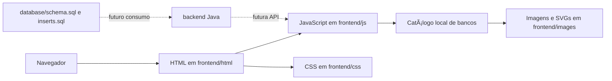

# Aprovação Passo a Passo

Plataforma visual para venda de cursos preparatórios de concursos bancários. O projeto apresenta um catálogo premium de bancos, cards de compra, identidade neon/cyberpunk e uma estrutura inicial para integração futura com backend Java e banco de dados.

> Estado atual: o frontend estático e a página de catálogo estão funcionais. O backend e os scripts SQL existem como base de evolução, mas ainda não estão conectados à interface.

## Sumário

- [Visão geral](#visão-geral)
- [Tecnologias e estado do projeto](#tecnologias-e-estado-do-projeto)
- [Como executar](#como-executar)
- [Estrutura de diretórios](#estrutura-de-diretórios)
- [Frontend](#frontend)
- [Catálogo de bancos](#catálogo-de-bancos)
- [Assets e identidade visual](#assets-e-identidade-visual)
- [Banco de dados](#banco-de-dados)
- [Backend](#backend)
- [Customização e manutenção](#customização-e-manutenção)
- [Limitações atuais](#limitações-atuais)

## Visão geral



A entrada principal é a landing page em `frontend/index.html`. Ela apresenta a proposta da plataforma, o responsável pelo projeto e a transição para o catálogo bancário em `frontend/bancos.html`, onde ficam os cursos por instituição.

## Tecnologias e estado do projeto

| Camada | Tecnologia atual | Estado |
| --- | --- | --- |
| Frontend | HTML5, CSS3 e JavaScript puro | Implementado e executável sem build |
| Design | SVG, PNG, Google Fonts, layout responsivo | Implementado |
| Catálogo | Array local em `frontend/js/bancos.js` | Implementado |
| Banco de dados | Scripts SQL para tabela `banks` | Estrutura pronta, não integrada |
| Backend | Estrutura de diretórios Java e `application.properties` | Scaffold inicial, sem código Java ou build configurado |

Não há `package.json`, `pom.xml`, `build.gradle`, dependências npm, wrapper Maven ou Gradle no repositório atual. Portanto, não é necessário instalar pacotes para visualizar o frontend.

## Como executar

### Opção 1: abrir diretamente

Abra `frontend/index.html` no navegador. A página foi validada usando a URL local do arquivo e não exige servidor para renderizar a landing ou o catálogo.

Use os CTAs **Explorar bancos** ou **Ver todos os bancos** para acessar o catálogo. Também é possível abrir `frontend/bancos.html` diretamente.

### Opção 2: servir por HTTP local

Recomendado para testar como a aplicação se comportará em hospedagem estática:

```powershell
Set-Location frontend
python -m http.server 5500
```

Depois, abra:

```text
http://localhost:5500/index.html
```

Também é possível usar qualquer extensão de servidor estático do VS Code.

## Estrutura de diretórios

```text
APPBANCOS/
|-- README.md
|-- frontend/
|   |-- assets/
|   |   |-- neon-cyber-bg.svg          # Fundo neon ativo do catálogo
|   |   `-- neon-corporate-bg.svg      # Variação alternativa de fundo
|   |-- css/
|   |   |-- style.css                  # Estilos globais
|   |   |-- landing.css                # Landing page de apresentação
|   |   |-- bancos.css                 # Catálogo bancário e cards
|   |   |-- responsive.css             # Breakpoints
|   |   |-- cards.css
|   |   |-- cursos.css
|   |   |-- dashboard.css
|   |   |-- header.css
|   |   `-- outros-bancos.css
|   |-- html/
|   |   |-- index.html                 # Landing page e entrada principal
|   |   |-- bancos.html                # Catálogo de cursos por banco
|   |   |-- curso.html
|   |   |-- cursos.html
|   |   |-- dashboard.html
|   |   |-- login.html
|   |   |-- outros-bancos.html
|   |   `-- perfil.html
|   |-- images/
|   |   |-- bancos/                    # Capas e logos dos bancos
|   |   |-- logo/                      # Marca da plataforma
|   |   |-- banners/
|   |   |-- cursos/
|   |   |-- icones/
|   |   `-- icons/
|   `-- js/
|       |-- landing.js                 # Revelação e movimento sutil da landing
|       |-- bancos.js                  # Renderização do catálogo
|       |-- main.js                    # Tema e fallback de arte
|       |-- cursos.js
|       |-- dashboard.js
|       |-- login.js
|       |-- outros-bancos.js
|       `-- usuario.js
|-- backend/
|   |-- java/
|   |   |-- config/
|   |   |-- controller/
|   |   |-- model/
|   |   |-- repository/
|   |   |-- security/
|   |   `-- service/
|   `-- resources/
|       `-- application.properties
`-- database/
		|-- schema.sql
		`-- inserts.sql
```

## Frontend

### Landing page

Arquivo: `frontend/index.html`

A landing reúne quatro áreas:

- hero com o posicionamento da plataforma e CTA para a seleção de bancos;
- apresentação do Prof. Betão e do propósito do projeto;
- convite final para explorar as instituições bancárias disponíveis.
- rodapé temático com contatos, mensagem, suporte e CTA para o WhatsApp informado.

Os estilos específicos ficam em `frontend/css/landing.css`, isolados das regras de `bancos.css`. O arquivo `frontend/js/landing.js` revela seções ao entrar na viewport, aplica parallax discreto para ponteiros precisos e respeita `prefers-reduced-motion`.

### Catálogo bancário

Arquivo: `frontend/bancos.html`

Responsabilidades principais:

- Exibe a marca `Aprovação Passo a Passo`.
- Renderiza os cards dentro de `#banksGrid` a partir de um template HTML.
- Usa o background responsivo `frontend/assets/neon-cyber-bg.svg` em tela cheia.
- Mostra menu contextual por card, fechado ao clicar fora ou pressionar `Esc`.
- Mantém o CTA de compra e o botão de carrinho para cursos publicados.

### Layout responsivo

O catálogo usa a seguinte grade no estado atual:

| Largura | Colunas |
| --- | --- |
| Desktop | 5 |
| Ate 1024px | 3 |
| Ate 768px | 2 |
| Ate 640px | 1 |

Os estilos principais da tela ficam em `frontend/css/bancos.css`; os breakpoints complementares ficam em `frontend/css/responsive.css`.

### Tema e fallback visual

`frontend/js/main.js` fornece:

- persistencia do tema no `localStorage` com a chave `aprovacao-passoa-passo-theme`;
- os temas `dark` e `midnight`;
- geracao de uma arte SVG em data URI como ultimo fallback de imagem de banco.

O catalogo atual nao mostra um botao de alternancia de tema no cabecalho, mas a infraestrutura de tema permanece disponivel para outras telas ou futuras interfaces.

## Catálogo de bancos

O catalogo e definido localmente no array `banks` de `frontend/js/bancos.js`.

| Ordem | Banco | Sigla | Estado atual |
| --- | --- | --- | --- |
| 1 | Banco do Brasil | BB | Publicado |
| 2 | Caixa Economica Federal | CAIXA | Publicado |
| 3 | Banco da Amazonia | BASA | Publicado |
| 4 | Banco do Nordeste | BNB | Publicado |
| 5 | Banco Nacional de Desenvolvimento Economico e Social | BNDES | Publicado |
| 6 | Banco de Brasilia | BRB | Publicado |
| 7 | Banrisul | BANRISUL | Publicado |
| 8 | Banestes | Banco do Estado do Espirito Santo | Publicado |
| 9 | Banpara | Banco do Estado do Para | Publicado |
| 10 | Banese | Banco do Estado de Sergipe | Publicado |
| 11 | BDMG | Banco de Desenvolvimento de Minas Gerais | Publicado |
| 12 | BRDE | Banco Regional de Desenvolvimento do Extremo Sul | Publicado |
| 13 | BANDES | Banco de Desenvolvimento do Espirito Santo | Publicado |

### Regras de carregamento das capas

Para cada banco, o renderer tenta as fontes nesta ordem:

1. `frontend/images/bancos/<imageKey>.png`;
2. `frontend/images/bancos/<imageKey>.svg`;
3. arte SVG gerada no navegador por `createBankArtwork`.

As capas originais em PNG estao presentes para `bb`, `caixa`, `basa`, `bnb`, `bndes`, `brb`, `banrisul`, `banese`, `banpara` e `banestes`. As capas de `bdmg`, `brde` e `bandes` possuem SVG local como fallback visual atual.

Os links `linkCompra` atuais usam `https://example.com/...` e devem ser substituidos pelos links reais de checkout antes de publicar a plataforma.

## Assets e identidade visual

| Asset | Uso |
| --- | --- |
| `frontend/assets/banking-architecture-bg.png` | Fundo oficial enviado, com arquitetura, logos bancárias e iluminação azul/dourada |
| `frontend/assets/neon-cyber-bg.svg` | Asset legado do fundo neon anterior, não aplicado nas telas principais |
| `frontend/assets/neon-corporate-bg.svg` | Versao alternativa de ambiente corporativo futurista |
| `frontend/images/professor/prof-betao.png` | Foto oficial do Prof. Betão usada na landing page |
| `frontend/images/professor/prof-betao-signature-white.png` | Assinatura branca do Prof. Betão sobreposta à foto da landing |
| `frontend/images/logo/aprovacao-logo.svg` | Logo exibida no cabecalho do catalogo |
| `frontend/images/bancos/*.png` | Capas originais recebidas para os cards |
| `frontend/images/bancos/*.svg` | Capas complementares e fallbacks locais |

O fundo oficial usa `background-size: cover` e `background-position: center center`, mantendo a arquitetura central como ponto de foco e preservando a proporção original. Um overlay discreto de contraste é aplicado separadamente para a leitura dos cards e textos, sem alterar o arquivo de imagem.

A foto de `prof-betao.png` possui transparência e é exibida com `object-fit: contain`, preservando o enquadramento original dentro da moldura da landing. A assinatura derivada do arquivo fornecido é mantida em branco, com fundo transparente, e fica sobreposta no canto inferior direito da moldura.

## Banco de dados

Arquivos:

- `database/schema.sql`
- `database/inserts.sql`

### Tabela `banks`

| Coluna | Tipo | Descricao |
| --- | --- | --- |
| `id` | `INTEGER` | Identificador primario |
| `name` | `VARCHAR(200)` | Nome do banco/curso |
| `sigla` | `VARCHAR(20)` | Sigla ou identificacao curta |
| `status` | `VARCHAR(20)` | Estado de publicacao |
| `link_compra` | `TEXT` | URL de compra |
| `image_path` | `TEXT` | Caminho da imagem de capa |
| `created_at` | `TIMESTAMP` | Data de criacao, com valor padrao atual |

O schema tambem cria indices para `status` e `sigla`.

### Como preparar dados

Execute `schema.sql` antes de `inserts.sql` no banco SQL escolhido. O projeto nao inclui driver, URL de conexao, credenciais ou ferramenta de migracao; esses detalhes precisam ser definidos ao implementar o backend.

Os inserts de exemplo atualmente contem cinco bancos, enquanto o frontend possui treze itens no catalogo local. A integracao futura deve unificar essas duas fontes de dados.

## Backend

O diretorio `backend/java` organiza a futura aplicacao em camadas:

| Diretorio | Responsabilidade planejada |
| --- | --- |
| `config/` | Configuracoes da aplicacao |
| `controller/` | Endpoints HTTP |
| `model/` | Entidades e DTOs |
| `repository/` | Persistencia |
| `security/` | Autenticacao e autorizacao |
| `service/` | Regras de negocio |

Atualmente esses diretorios contem somente arquivos `.gitkeep`; nao ha classes Java, classe principal do Spring Boot ou arquivo de build. O unico arquivo de configuracao existente e `backend/resources/application.properties`:

```properties
spring.application.name=aprovacao-passo-a-passo
server.port=8080
```

Para transformar essa estrutura em uma API funcional, sera necessario adicionar, no minimo:

1. Um projeto Spring Boot com `pom.xml` ou `build.gradle`.
2. Uma classe principal da aplicacao.
3. Configuracao de datasource e driver do banco escolhido.
4. Entidade, repositorio, servico e controller para `banks`.
5. Endpoints consumidos pelo frontend em substituicao ao array local.
6. Autenticacao, autorizacao e validacao de URLs de compra antes de producao.

## Customização e manutenção

### Adicionar ou alterar um banco

1. Edite o array `banks` em `frontend/js/bancos.js`.
2. Defina `id`, `name`, `sigla`, `subtitle`, `imageKey`, `status`, `linkCompra` e `colors`.
3. Adicione a capa em `frontend/images/bancos/` usando `<imageKey>.png`.
4. Opcionalmente adicione `<imageKey>.svg` como fallback.
5. Se o banco tambem for persistido, atualize os scripts SQL ou a futura API.

### Alterar o fundo oficial

O asset atual é `frontend/assets/banking-architecture-bg.png`. Ele é aplicado em `body::before`, `body.bancos-showcase::before` e `body.landing-page::before`; mantenha a mesma proporção ao substituí-lo. Os antigos LEDs de borda foram removidos das telas principais.

### Atualizar a imagem do professor

Substitua `frontend/images/professor/prof-betao.png` por uma imagem autorizada do Prof. Betão. Prefira uma foto vertical com transparência; o frame da landing usa `object-fit: contain` para preservar a composição.

### Alterar a grade e o tamanho dos cards

Edite as regras finais de `frontend/css/bancos.css`:

- `.bancos-showcase .banks-grid` controla colunas e espacamento;
- `.bank-card` controla a altura e a proporcao de capa/conteudo;
- `.bank-card__media` e `.bank-card__body` controlam as duas partes do card.

## Limitações atuais

- Nao ha API, autenticacao real, checkout real ou persistencia integrada.
- Os links de compra sao placeholders em `example.com`.
- As acoes do menu do card sao visuais; nao salvam alteracoes.
- Nao ha suite automatizada de testes, linter configurado ou pipeline de CI no repositorio.
- O backend nao pode ser iniciado ate que um projeto Java/Spring executavel seja adicionado.
- Os dados do SQL e do frontend ainda nao estao sincronizados.

## Verificação manual recomendada

Antes de publicar, valide ao menos:

1. O carregamento de `frontend/index.html` em desktop e celular, incluindo os CTAs para o catálogo.
2. O carregamento e o enquadramento da foto do professor na landing.
3. A exibicao das 13 capas e o fallback de imagem quando um asset estiver ausente.
4. O menu de cada card, incluindo fechamento por clique externo e tecla `Esc`.
5. Os links reais de compra em uma nova aba.
6. A execucao de `schema.sql` e `inserts.sql` no banco selecionado.
7. A substituicao do catalogo local por uma API quando o backend estiver pronto.

## Licença

Nenhum arquivo de licenca foi encontrado no repositorio. Defina uma licenca antes de distribuir ou abrir o projeto para contribuicoes externas.
# APROVA-O-PASSO-A-PASSO13.0


