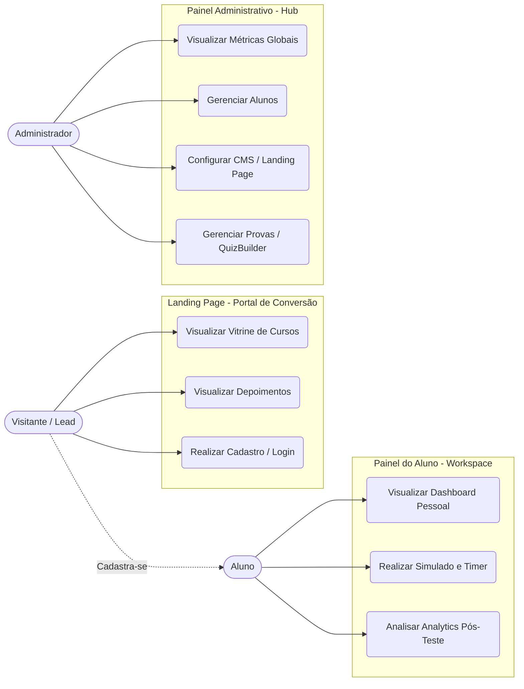
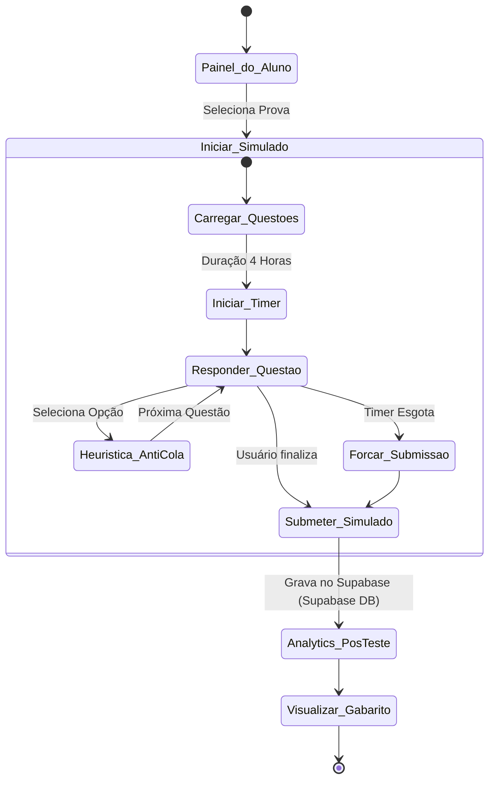
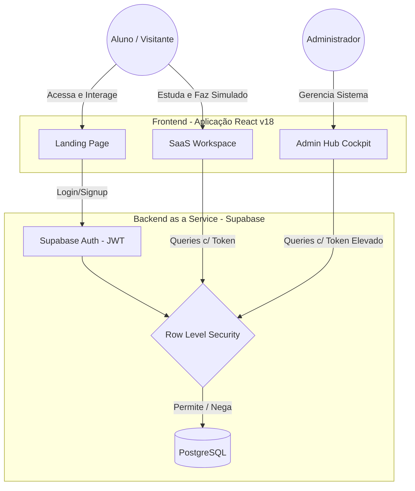

# Documentação de Casos de Uso e Diagramas - Beto Banco

Esta documentação descreve os Atores, Casos de Uso e a Arquitetura da plataforma SaaS **Beto Banco**.

## 1. Atores do Sistema

- **Visitante / Lead:** Usuário anônimo que acessa a Landing Page em busca de informações sobre a plataforma e preparação bancária.
- **Aluno:** Usuário autenticado (aprovado/matriculado) que tem acesso ao ambiente de estudos (SaaS Workspace) e realiza simulados.
- **Administrador (Admin / Instrutor):** Usuário com privilégios elevados (`ROLE_ADMIN`) responsável por gerir a plataforma, alunos, simulados e a Landing Page.

## 2. Diagrama de Casos de Uso Geral

Abaixo o diagrama de casos de uso geral mapeando a interação dos atores com o sistema:

```mermaid
usecaseDiagram
    actor Visitante as "Visitante (Lead)"
    actor Aluno as "Aluno"
    actor Admin as "Administrador"

    Visitante <|-- Aluno : "Evolui para"

    package "Landing Page (Portal de Conversão)" {
        usecase "Visualizar Vitrine de Cursos" as UC1
        usecase "Visualizar Depoimentos" as UC2
        usecase "Realizar Cadastro / Login" as UC3
    }

    package "Painel do Aluno (SaaS Workspace)" {
        usecase "Visualizar Dashboard Pessoal" as UC4
        usecase "Realizar Simulado" as UC5
        usecase "Analisar Analytics Pós-Teste" as UC6
    }

    package "Painel Administrativo (SaaS Hub)" {
        usecase "Visualizar Métricas Globais" as UC7
        usecase "Gerenciar Alunos (CRUD)" as UC8
        usecase "Gerenciar Landing Page (CMS)" as UC9
        usecase "Gerenciar Questões / Provas (QuizBuilder)" as UC10
    }

    Visitante --> UC1
    Visitante --> UC2
    Visitante --> UC3

    Aluno --> UC4
    Aluno --> UC5
    Aluno --> UC6

    Admin --> UC7
    Admin --> UC8
    Admin --> UC9
    Admin --> UC10
```
*(Nota: Embora o Mermaid não possua sintaxe oficial pura para "usecaseDiagram" robusto, utilizamos frequentemente flowcharts ou a sintaxe experimental/apropriada para representar)*

Para melhor compatibilidade com motores de renderização, segue a versão em `flowchart` do modelo comportamental de atores e ações:



## 3. Fluxo de Realização de Simulado (Activity Diagram)

O diagrama de atividades abaixo detalha a *Feature de Ouro* da plataforma: o motor de simulados, simulando as bancas CEBRASPE e CESGRANRIO.



## 4. Arquitetura do Sistema e Fluxo de Dados (C4 Model - Context)

Baseado no README e Arquitetura técnica.



## 5. Casos de Uso Detalhados

### 5.1 Realizar Simulado (Aluno)
- **Ator Principal:** Aluno
- **Pré-condições:** O Aluno deve estar autenticado e o token JWT válido.
- **Fluxo Principal:**
  1. O aluno seleciona o simulado desejado no Dashboard.
  2. O sistema carrega as questões e inicia o timer (4 horas persitentes).
  3. O aluno seleciona a resposta para cada questão. A heurística "Right/Wrong" é aplicada, impedindo desfazer a escolha em cenários específicos.
  4. O aluno submete o simulado voluntariamente (ou o sistema força a submissão ao esgotar o tempo).
  5. O sistema processa o gabarito.
  6. O sistema exibe o Analytics Pós-Teste (Taxa de Acertos) sincronizando com a base transacional (Supabase `simulado_attempts`).

### 5.2 Gerenciar Landing Page - CMS (Admin)
- **Ator Principal:** Administrador
- **Pré-condições:** Usuário logado com FLAG `ROLE_ADMIN` garantida pelo Supabase.
- **Fluxo Principal:**
  1. O Admin acessa o Cockpit (SaaS Hub).
  2. Seleciona a opção de edição de Landing Page CMS.
  3. Altera textos, links de vídeos promocionais ou seções do "Hero".
  4. O sistema persiste a alteração na tabela `site_settings`.
  5. O site em tempo real atualiza os dados na rota pública.

### 5.3 Captura de Lead (Visitante)
- **Ator Principal:** Visitante
- **Fluxo Principal:**
  1. O Visitante acessa a Landing Page.
  2. Clica em um Call-to-Action (CTA).
  3. É redirecionado à página `/login`.
  4. O visitante cria sua conta (Supabase Auth).
  5. O sistema captura o e-mail (Lead) e cria um registro centralizado na tabela `profiles` via Trigger do banco de dados.
